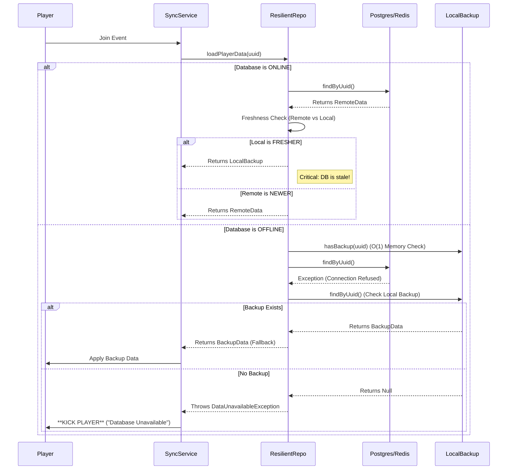
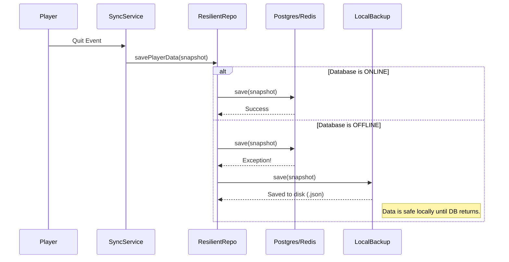
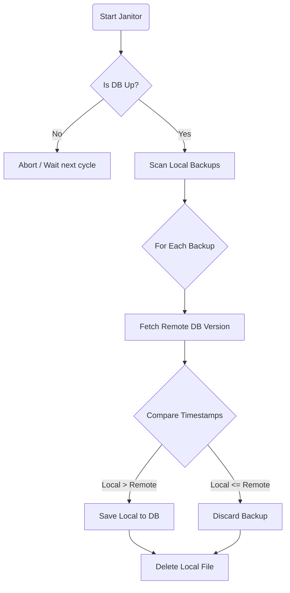

# System Behavior & Architecture

This document describes how **Magnus Sync** handles data synchronization, failure scenarios, and automatic recovery using Hexagonal Architecture.

## 1. Player Join (Loading Data)

When a player joins the server, we attempt to load their data from the Persistence Layer.



## 2. Player Quit (Saving Data)

When a player leaves, we capture their state and save it.



## 3. Recovery Strategy ("The Janitor")

A background service (`BackupRecoveryService`) runs every 5 minutes to attempt to merge local backups into the database.



## 4. Performance Optimization (In-Memory Dirty Set)
To avoid checking the disk (`File.exists()`) on every player join, we use an **In-Memory Optimization**.

### The "Dirty Set" (Bloom Filter / Set)
*   **What**: A `Set<UUID>` kept in RAM.
*   **Init**: Scans the backup folder *once* on startup.
*   **Join**: Checks `set.contains(uuid)`.
    *   **False**: Skip disk check entirely. **0ms overhead**.
    *   **True**: Perform disk I/O and Freshness Check.
*   **Save**: On fallback save, add UUID to Set.
*   **Recover**: On Janitor delete, remove UUID from Set.
```
