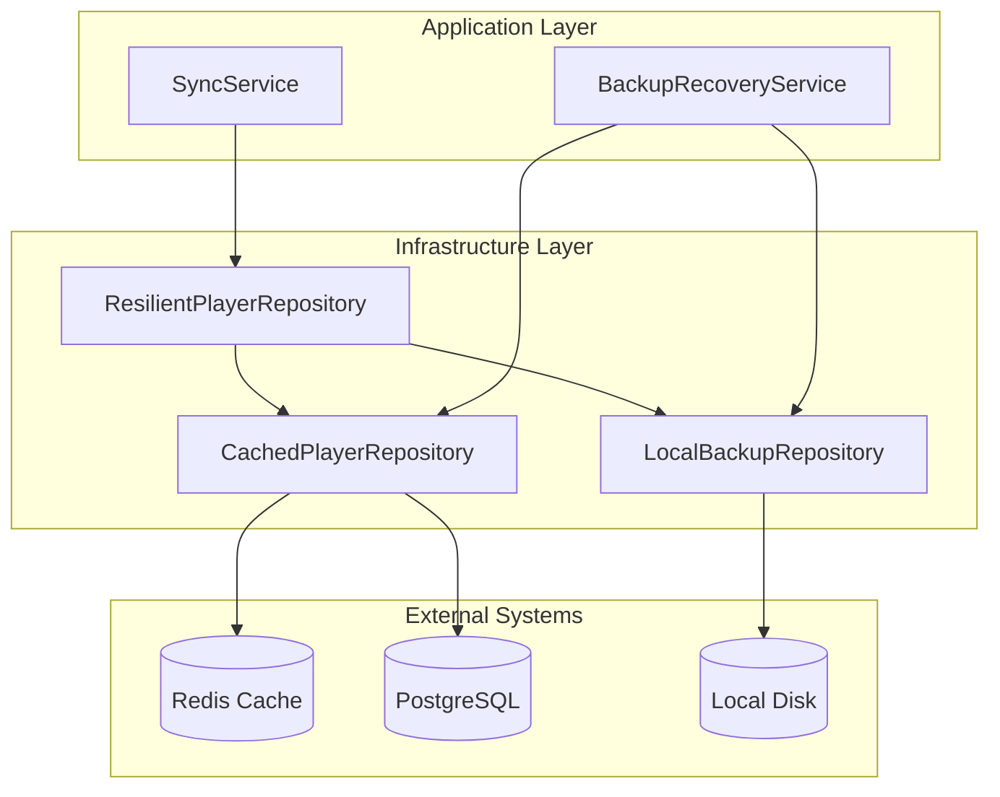
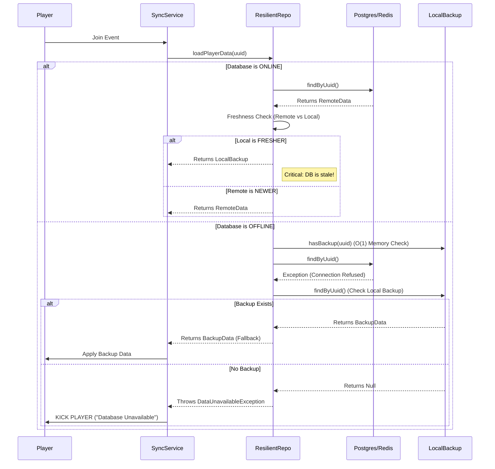
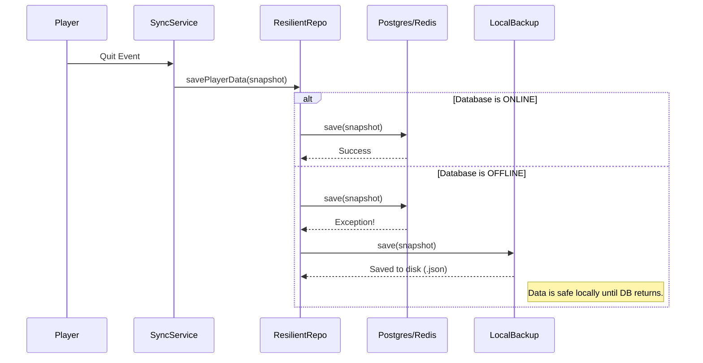
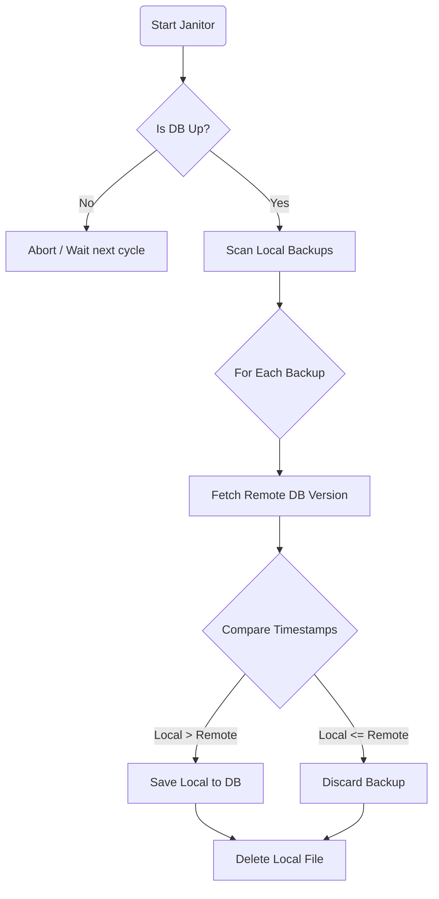
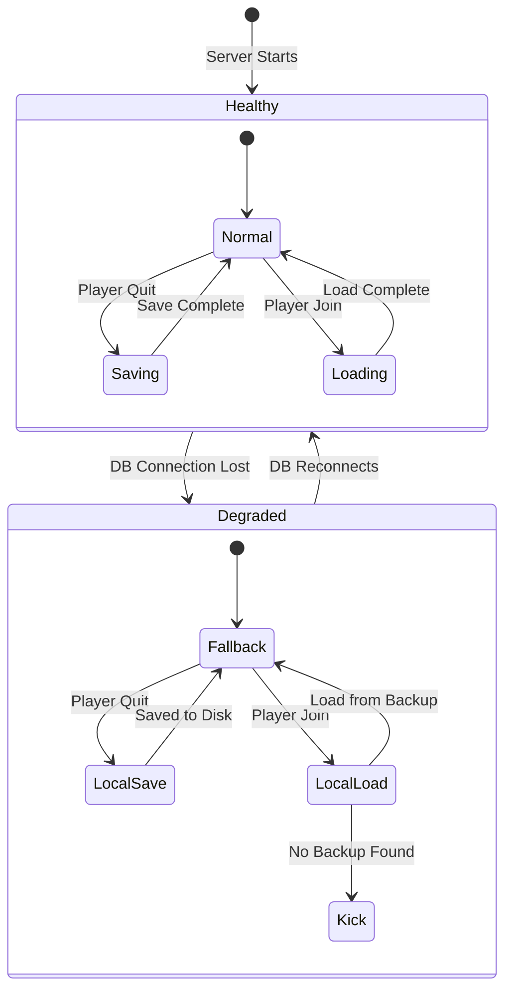
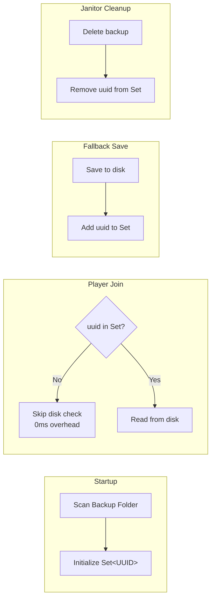

# Core Sync Module - Flow Diagram

## Overview

Magnus Sync handles player data synchronization between Minecraft servers using a resilient architecture with automatic failover and recovery. This document describes how data flows through the system during player join/leave events and failure scenarios.

## Architecture



## Player Join (Loading Data)

When a player joins the server, we attempt to load their data from the Persistence Layer.



## Player Quit (Saving Data)

When a player leaves, we capture their state and save it.



## Recovery Strategy ("The Janitor")

A background service (`BackupRecoveryService`) runs every 5 minutes to attempt to merge local backups into the database.



## Data Flow States



## Performance Optimization (Dirty Set)

To avoid checking the disk (`File.exists()`) on every player join, we use an **In-Memory Optimization**.



## Key Components

| Component | Purpose |
|-----------|---------|
| `SyncService` | Orchestrates load/save operations with lock management |
| `ResilientPlayerRepository` | Wraps primary repo with local fallback logic |
| `CachedPlayerRepository` | Redis cache layer over PostgreSQL |
| `LocalBackupRepository` | JSON file-based backup storage |
| `BackupRecoveryService` | "The Janitor" - periodic backup recovery |

## Configuration

Core sync is always enabled. Configure database connections in `config/magnus.json`:

```json
{
    "postgresUrl": "jdbc:postgresql://host:5432/magnus",
    "postgresUser": "user",
    "postgresPass": "password",
    "redisHost": "localhost",
    "redisPort": 6379
}
```

> [!IMPORTANT]
> If both database and local backup are unavailable, players will be **kicked** to prevent data corruption.

> [!TIP]
> Local backups are stored in `config/magnus/backups/` as JSON files named by player UUID.
