# Global Chat Module - Flow Diagram

## Overview

The Global Chat module synchronizes chat messages across all servers connected to the same Redis instance. Messages are published raw (no formatting) to preserve compatibility with chat formatting mods like LuckPerms and Stylist.

## Architecture


## Sequence Diagram

```mermaid
sequenceDiagram
    participant P as Player
    participant FEL as ChatEventListener
    participant GCS as GlobalChatService
    participant Redis as Redis
    participant GCS2 as GlobalChatService<br>(Other Server)
    participant P2 as Remote Player

    P->>FEL: sends chat message
    FEL->>GCS: publishMessage(uuid, name, rawText)
    GCS->>GCS: serialize to ChatMessage JSON
    GCS->>Redis: PUBLISH magnus:chat {json}
    
    Note over Redis: Redis broadcasts to all subscribers
    
    Redis->>GCS2: onMessage callback
    GCS2->>GCS2: deserialize ChatMessage
    GCS2->>GCS2: check serverName != local
    GCS2->>P2: sendMessage(formatted text)
```



## Data Flow

### Outgoing (Local → Redis)

1. **Player sends chat** → Fabric `ServerMessageEvents.CHAT_MESSAGE` event fires
2. **ChatEventListener** intercepts and extracts raw message content
3. **GlobalChatService.publishMessage()** creates `ChatMessage` DTO
4. Message serialized to JSON and published to `magnus:chat` channel

### Incoming (Redis → Local)

1. Redis delivers message via subscription callback
2. **GlobalChatService.onMessageReceived()** deserializes JSON
3. **Echo check**: If `serverName` matches local server, message is ignored
4. Message broadcast to all local players via `player.sendMessage()`

## ChatMessage Schema

```json
{
  "serverName": "survival",
  "playerUuid": "uuid-string",
  "playerName": "PlayerName",
  "rawMessage": "Hello world!",
  "timestamp": 1706654400000
}
```

## Configuration

Enable in `config/magnus.json`:

```json
{
  "serverName": "survival",
  "enableGlobalChat": true
}
```

> [!IMPORTANT]
> Each server must have a unique `serverName` to prevent echo loops.
