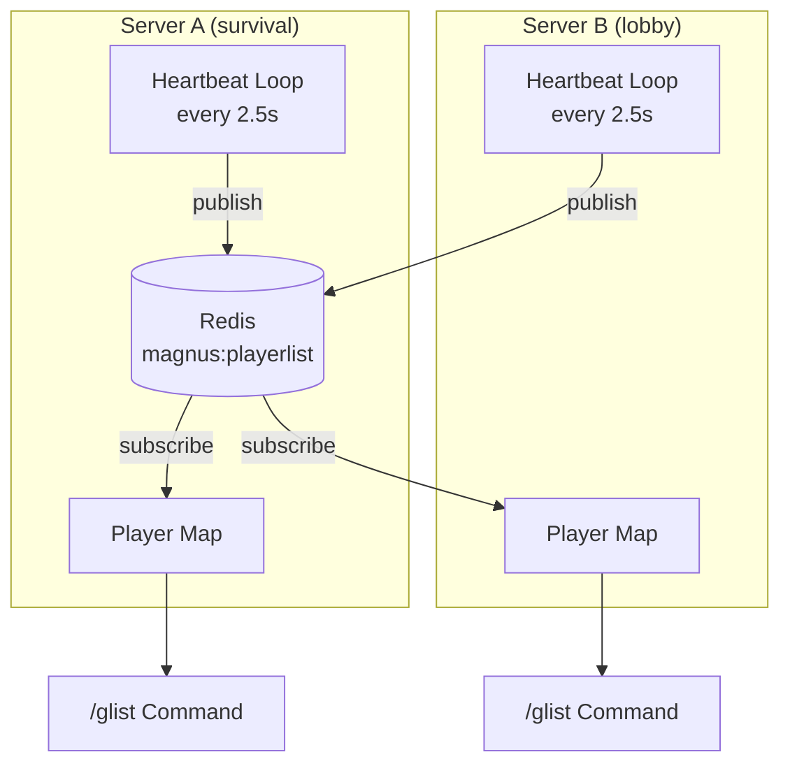
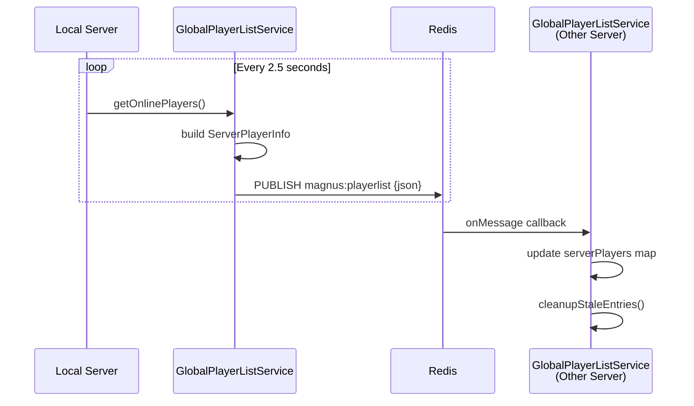
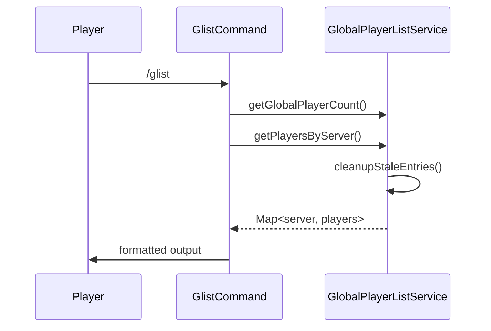
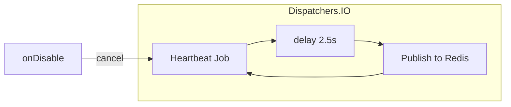

# Global Player List Module - Flow Diagram

## Overview

The Global Player List module maintains a synchronized view of all players across the server network. It uses a heartbeat mechanism to publish local player lists and aggregates data from all servers into an in-memory map.

## Architecture



## Heartbeat Sequence



## /glist Command Flow



## Data Structures

### ServerPlayerInfo (Heartbeat Payload)

```json
{
  "serverName": "survival",
  "players": [
    {"uuid": "...", "name": "Player1"},
    {"uuid": "...", "name": "Player2"}
  ],
  "timestamp": 1706654400000
}
```

### In-Memory Map

```
ConcurrentHashMap<String, ServerPlayerInfo>
├── "survival" → ServerPlayerInfo(players=[...], timestamp=...)
├── "lobby"    → ServerPlayerInfo(players=[...], timestamp=...)
└── "creative" → ServerPlayerInfo(players=[...], timestamp=...)
```

## Stale Entry Cleanup

Servers that haven't sent a heartbeat in **10 seconds** are automatically removed from the map. This handles:
- Server crashes
- Network partitions
- Graceful shutdowns

## /glist Output Example

```
§6§l=== Global Player List ===
§7Total players online: §f15

§asurvival §7[8]: §fPlayer1, §fPlayer2, §fPlayer3, ...
§alobby §7[5]: §fNewPlayer, §fGuest1, ...
§acreative §7[2]: §fBuilder1, §fBuilder2
```

## Configuration

Enable in `config/magnus.json`:

```json
{
  "serverName": "survival",
  "enableGlobalPlayerList": true
}
```

## Coroutine Architecture



> [!TIP]
> The heartbeat runs on `Dispatchers.IO` to avoid blocking the server thread.
