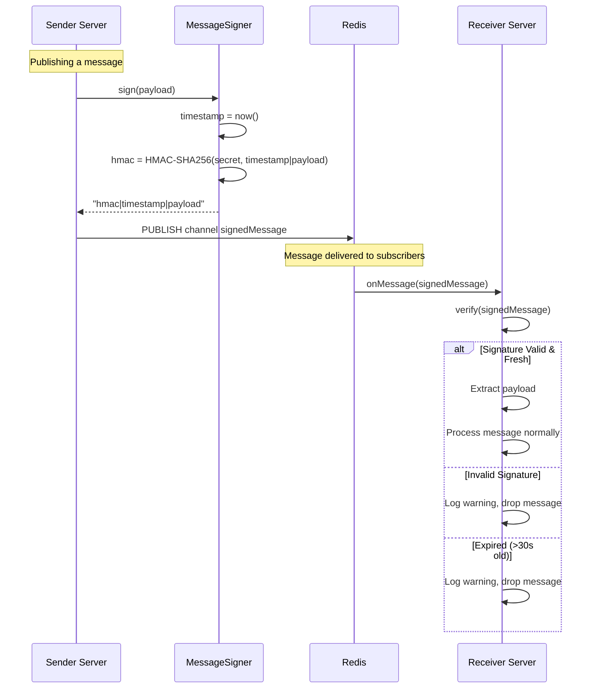
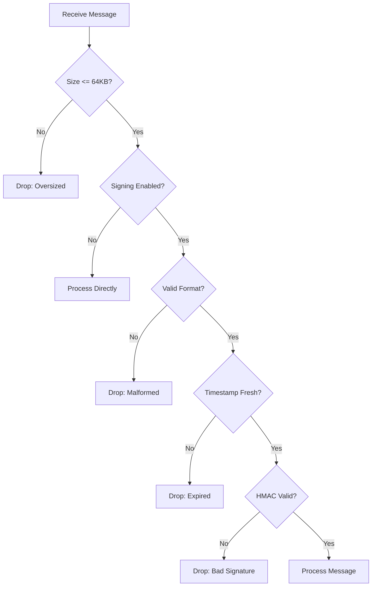

# Message Security - Flow Diagram

## Overview

Magnus uses HMAC-SHA256 message signing to prevent message injection attacks on the Redis Pub/Sub channels. This ensures only trusted servers can send valid messages.

## Security Architecture

```mermaid
graph LR
    subgraph "Server A (Trusted)"
        MsgA[Message] --> SignerA[MessageSigner]
        SignerA -->|sign| SignedA["signature|timestamp|payload"]
        SignedA --> BusA[SecureRedisMessageBus]
        BusA -->|PUBLISH| Redis[(Redis)]
    end
    
    subgraph "Server B (Trusted)"
        Redis -->|SUBSCRIBE| BusB[SecureRedisMessageBus]
        BusB --> VerifyB{Verify Signature}
        VerifyB -->|valid| CallbackB[Process Message]
        VerifyB -->|invalid| DropB[Drop & Log]
    end
    
    subgraph "Attacker"
        Attacker[Malicious Client] -->|fake message| Redis
        Redis -->|SUBSCRIBE| BusB
    end
```

## Sequence Diagram



## Security Features

| Feature | Protection Against |
|---------|-------------------|
| **HMAC-SHA256 Signing** | Message injection/spoofing |
| **Timestamp Validation** | Replay attacks |
| **Timing-Safe Comparison** | Timing attacks |
| **Payload Size Limits** | DoS via large payloads |
| **Auto-Reconnection** | Connection disruption attacks |

## Signed Message Format

```
BASE64(HMAC-SHA256)|TIMESTAMP|ORIGINAL_PAYLOAD
```

Example:
```
aG1hYy1zaWduYXR1cmU=|1706654400000|{"serverName":"survival","message":"hello"}
```

## Configuration

Security is **enabled by default**. The signing secret is auto-generated on first run:

```json
{
  "enableMessageSigning": true,
  "messageSigningSecret": "auto-generated-32-byte-base64-secret",
  "maxMessageSizeBytes": 65536,
  "redisSsl": false
}
```

> [!IMPORTANT]
> For multi-server setups, copy the `messageSigningSecret` from the first server to all other servers.

## Validation Flow



## Key Files

| File | Purpose |
|------|---------|
| `MessageSigner.kt` | HMAC signing and verification |
| `SecureRedisMessageBus.kt` | Size limits, auto-reconnect, signing integration |
| `JedisPoolFactory.kt` | SSL/TLS connections |
| `MagnusConfig.kt` | Security configuration options |
