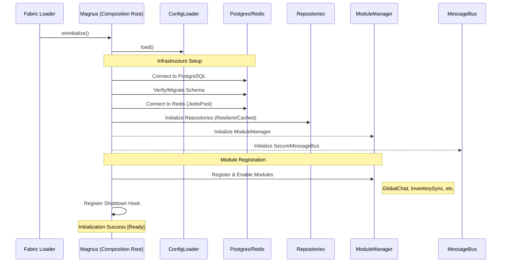
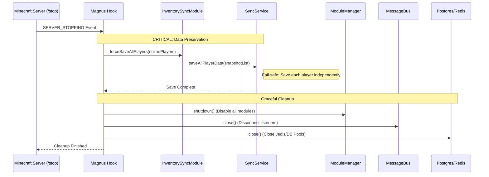

# Server Lifecycle - Flow Diagram

## Overview

This document describes the lifecycle of the Magnus Sync mod, from server initialization to graceful shutdown. It details the initialization of infrastructure services and the fail-safe mechanisms implemented to prevent data loss during shutdown.

## Server Startup (Mod Initialization)

The `Magnus.kt` class (Composition Root) orchestrates the wiring of all components when the server starts.

## Server Shutdown (Graceful Stop)

To prevent the common "Race Condition" where players are still online when the database closes, Magnus implements a priority shutdown sequence.

## Shutdown Priority

The shutdown process follows a strict order to ensure data integrity:

1.  **Forced Save**: Online players are snapshotted and saved to the persistent store immediately.
2.  **Module Shutdown**: Application-level logic is turned off.
3.  **Communication Closure**: Message buses are closed to stop incoming/outgoing global traffic.
4.  **Resource Release**: Database and cache connection pools are closed last.

> [!IMPORTANT]
> The `saveAllPlayerData` method in `SyncService` is designed to be "fail-safe". If saving one player fails due to a timeout or connection issue, it will log the error and continue with the remaining players, ensuring maximum data recovery during the shutdown window.

> [!NOTE]
> This priority sequence avoids the "Race Condition" where the `PlayerQuitEvent` might fire *after* the database connection has already been terminated by the mod's shutdown hook.
