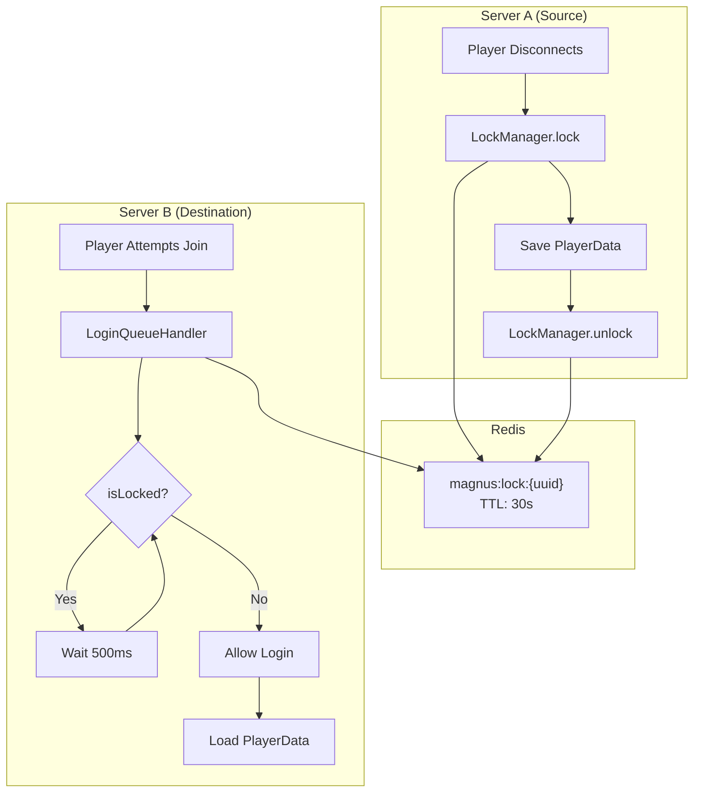
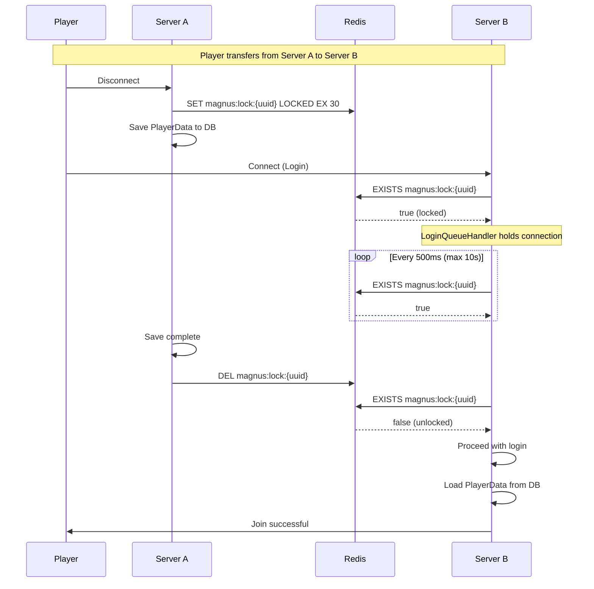
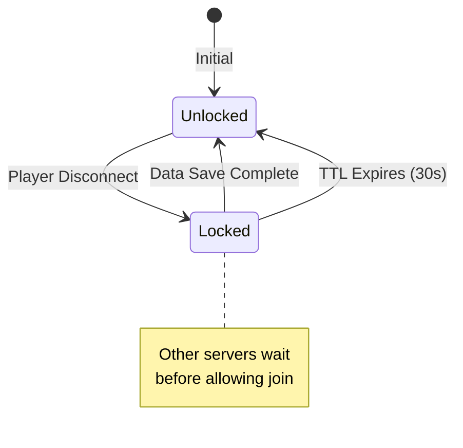

# Session Lock Module - Flow Diagram

## Overview

The Session Lock module prevents data corruption during cross-server player transfers by ensuring that a player's data is fully saved before they can join another server.

## Architecture



## Sequence Diagram



## Lock Lifecycle



## Key Components

| Component | Purpose |
|-----------|---------|
| `LockManager` | Redis-based distributed lock with 30s TTL |
| `LoginQueueHandler` | Holds login connections while waiting for lock release |
| `SyncService` | Calls lock/unlock during save operations |

## Configuration

Enable in `config/magnus.json`:

```json
{
  "enableSessionLock": true
}
```

## Safety Features

> [!IMPORTANT]
> The lock has a **30-second TTL** as a safety net. If Server A crashes during save, the lock will auto-expire and players won't be permanently locked out.

> [!TIP]
> If Redis is unavailable, the lock check **fails open** (allows login) to prevent blocking players due to infrastructure issues.
